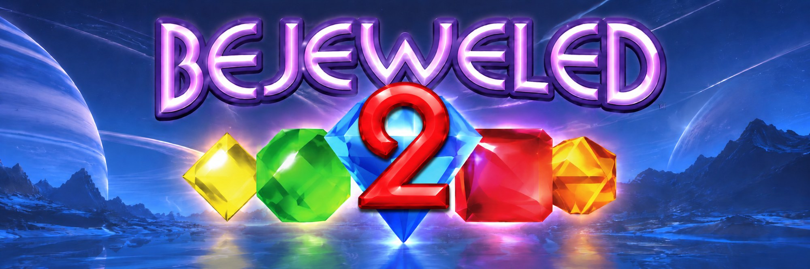

# BJ2GC

Bejeweled 2 Deluxe's Classic mode on the GameCube, built with Octave. The
game logic is reimplemented to behave as the original does (see `docs/`); the
art, fonts, sounds and music come from your own copy of the game and are never
committed.

## Making the data

```
python tools/make_data.py
```

It needs Bejeweled 2 Deluxe installed through Steam (app 3300): it finds the
game from Steam's own records, checks some of its files are the Steam copy's,
and refuses otherwise. It writes `BJ2GC/Scripts/Data/`:

- the backdrops, gems, frame and score pod as GameCube textures;
- three of the game's bitmap fonts;
- 20 sound effects as 16-bit PCM;
- the Classic music, rendered from `BeyondNetwork.mo3` (order 2, as
  `properties/music.xml` says) to Ogg Vorbis, about 19 MB.

It needs Pillow, plus the ffmpeg in `octave-libogc/External/ffmpeg`, which has
libopenmpt and libvorbis.

## Building

Package `BJ2GC/BJ2GC.octp` for GameCube with Octave (the same way as PPGC):

```
Octave.exe -headless -project <path>/BJ2GC/BJ2GC.octp -build GameCube
```

The disc image is `BJ2GC/Packaged/GameCube/BJ2GC.iso`, about 38 MB. Its
banner is `BJ2GC/opening.bnr`, made from `art/banner.png` by
`python tools/make_banner.py`.

There are test builds, each set in the environment when packaging:

- `AUTOPLAY=1` plays by itself: it makes the hint's move and starts a new
  game when one ends.
- `EXTRA=-DBJ2_PADTEST=1` drives the pad the way a player would: the cursor
  to the hint's gem, then A, then the direction.
- `EXTRA=-DBJ2_DEBUGKEYS=1` adds three buttons: Z completes the level (the
  level transition), L ends the game as if out of moves, and R makes the
  gem under the cursor a power gem, then a hypercube, then itself again.
- `EXTRA=-DBJ2_WARPTEST=1` completes each level 3 seconds after its board
  settles, to show the level transition.
- `EXTRA=-DBJ2_FXTEST=1` makes the hint's gem a power gem or a hypercube, by
  turns, and makes its move every 2 seconds.

They log their progress (score, level, matches, swaps undone) to the
console.

## Controls

| Button | Action |
|---|---|
| D-pad or stick | Move the cursor |
| A | Pick up a gem; then a direction swaps it |
| B | Put the gem down |
| Y or X | Show a hint |
| A or Start | New game, after "No moves" |

## Checking against the original

`bj2check` (CMake, PC) runs the same game code headless:

- `bj2check board SEED` prints the board a seed starts with.
- `bj2check fill-check SNAPSHOT.txt` checks the fill against a board saved
  from the original.
- `bj2check play SEED` plays a game by the hint.

The fill and the random numbers match the original exactly; the scoring,
the timings, the effects and the level transition follow the original's
(`docs/board-effects.md`, `docs/level-transition.md`).
